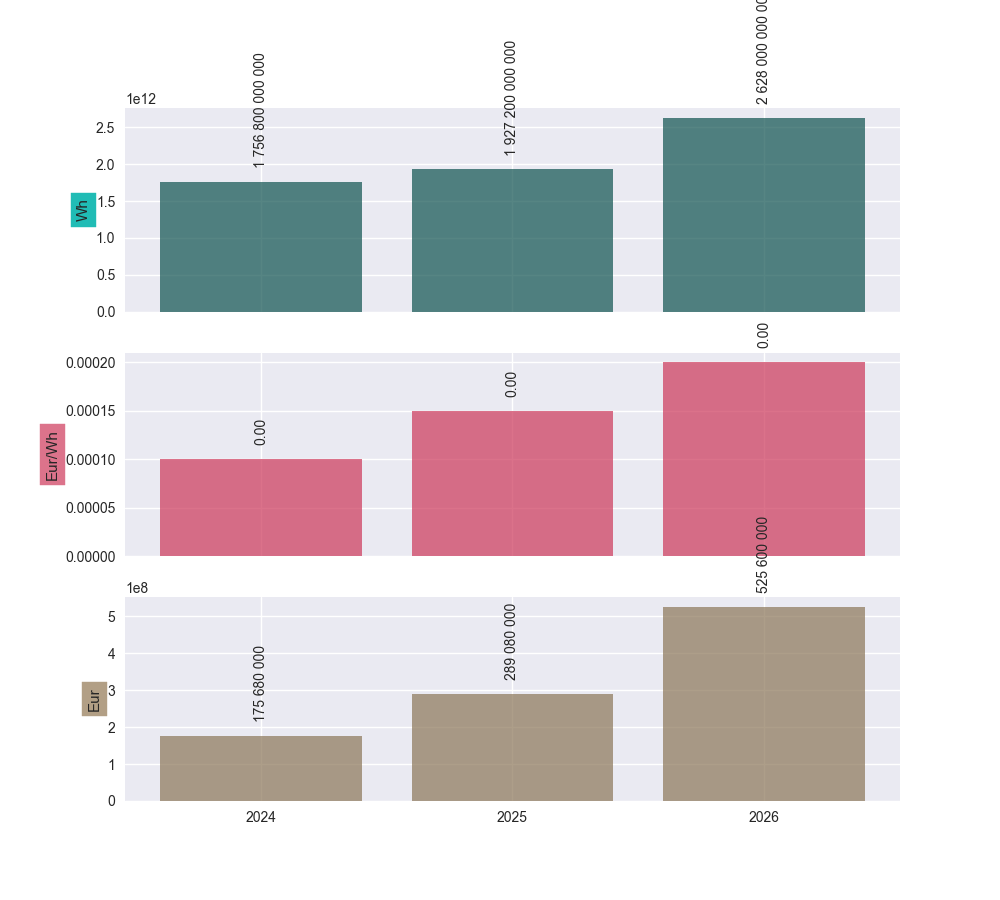
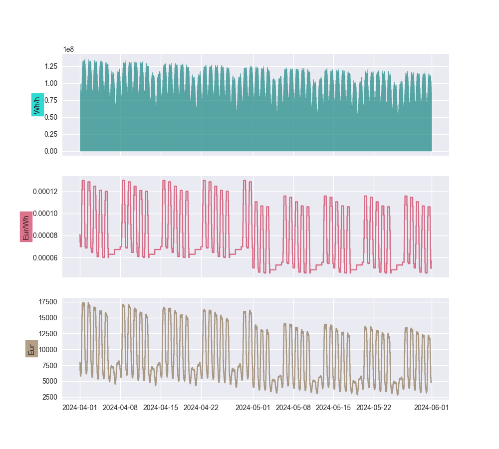
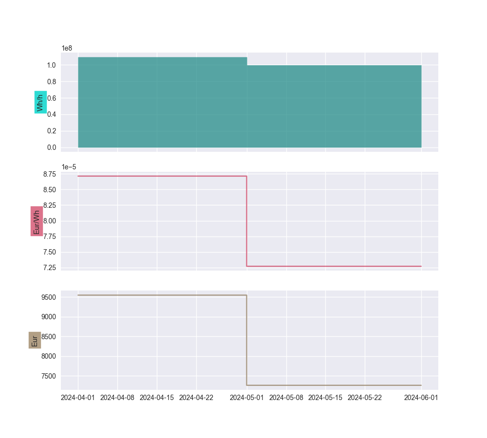

.. |_| unicode:: 0xA0 
   :trim:

======
PfLine
======

The basic building block of the ``portfolyo`` package is the "portfolio line" (``PfLine``). Instances of this class store a timeseries containing volume information, price information, or both. This page discusses their most important properties, and how to use them.

For a tutorial, :doc:`see here <../tutorial/index>`.

It is assumed that you are familiar with the following dimension abbrevations: ``w`` for power, ``q`` for energy, ``p`` for price, and ``r`` for revenue; see :doc:`this page for more information <../specialized_topics/dimensions>`.

.. contents:: Page contents:
   :depth: 1
   :local:

----
Kind
----

An important characteristic of a portfolio line is its "kind". The property ``PfLine.kind`` has a value from the ``portfolyo.Kind`` enumeration and tells us the type of information it contains:

* ``Kind.VOLUME``: "volume-only" portfolio line.

  This is a portfolio line that only contains volume information. 
  
  As an example, consider the expected/projected development of offtake volume of a customer or customer group.

  The volume in each timestamp can be retrieved by the user in units of energy (e.g., MWh) or in units of power (e.g., MW).

* ``Kind.PRICE``: "price-only" portfolio line.

  This is a portfolio line which only contains price information. 
  
  For example, the forward price curve for a certain market area, or the fixed offtake price that a customer is paying for a certain delivery period.

* ``Kind.REVENUE``: "revenue-only" portfolio line.

  For example, the payoff of a financially-settled put option, which has a monetary value (e.g., in Eur) without an associated volume being delivered.

* ``Kind.COMPLETE``

  This a portfolio line that contains volume, price and revenue information. 
  
  For example: the volume that has been sourced to hedge a certain portfolio, e.g. in monthly or quarterly blocks. 

  For each timestamp we have a volume (the contracted volume, both as energy and as power), a price (for which the volume was contracted) and a revenue (i.e., the multiplication of the energy and the price). 

"Volume-only" and "complete" portfolio lines contain redundant information. For the volume, the power (in MW) can be calculated by dividing the energy (in MWh) by the duration of the timestamp (in h). Likewise, the price (in Eur/MWh) can be calculated by dividing the revenue (in Eur) by the energy (in MWh). See also the note in the next section.

--------------
Initialisation 
--------------

There are many ways to specify the timeseries from which to initialise a portfolio line; here we will discuss the most common ones. In all cases it is assumed that :doc:`the data has been prepared and standardized<../specialized_topics/dataprep>`.

In General
==========

``portfolyo`` tries to determine the dimension of information (e.g., if it is a price or a volume) using its key (if it has one) and its unit (also, if it has one) - see the section on :ref:`Compatilibity of abbrevation and unit <nameunitcompatibility>`.

To initialise a volume-only / price-only / revenue-only portfolio line, we must only provide a volume / price / revenue timeseries. To initialise a complete portfolio line, we must supply at least 2 of the following timeseries: prices, volumes, revenues. 

.. note::
   
   Specifying volumes: it is not necessary to specify both power (``w``) and energy (``q``); for a given timestamp we can calculate one from the other. If both *are* specified, they should be consistent with each other. 

   Specifying volumes and prices: the same goes when specifying volume (either ``w`` or ``q``), price (``p``) and revenue (``r``). Only two are needed, and if more *are* specified, they should be consistent.

DataFrame or dictionary of timeseries...
========================================

or any other ``Mapping`` from (string) key values to ``pandas.Series``. 

The keys (or dataframe column names) must each be one of the following: ``w`` (power), ``q`` (energy), ``p`` (price), ``r`` (revenue). Depending on the keys, the ``.kind`` of the portfolio line is determined.

.. exec_code::
   
   import portfolyo as pf 
   import pandas as pd
   index = pd.date_range('2024', freq='AS', periods=3)
   input_dict = {'w': pd.Series([200, 220, 300.0], index)}
   pf.PfLine(input_dict)
   # --- hide: start ---
   print(repr(pf.PfLine(input_dict)))

Timeseries with unit
====================

Under the condition that a valid ``pint`` unit is present, we may also provide a single timeseries (``pandas.Series``), or an iterable of timeseries. They are automatically converted to the default unit.

.. exec_code::

   # --- hide: start ---
   import portfolyo as pf, pandas as pd
   index = pd.date_range('2024', freq='AS', periods=3)
   # --- hide: stop ---
   # using the imports and index from the previous example
   input_series = pd.Series([10, 11.5, 10.8], index, dtype='pint[ctEur/kWh]')
   pf.PfLine(input_series)
   # --- hide: start ---
   print(repr(pf.PfLine(input_series)))
   

Dictionary of portfolio lines...
================================

or any other ``Mapping`` from (string) key values to ``PfLine`` objects. 

The keys are used as the children names: 

.. exec_code::

   # --- hide: start ---
   import portfolyo as pf, pandas as pd
   index = pd.date_range('2024', freq='AS', periods=3)
   # --- hide: stop ---
   pfl1 = pf.PfLine(pd.Series([0.2, 0.22, 0.3], index, dtype='pint[GW]')) 
   pfl2 = pf.PfLine(pd.Series([100, 150, 200.0], index, dtype='pint[MW]')) 
   dict_of_children = {'southeast': pfl1, 'northwest': pfl2}
   pfl = pf.PfLine(dict_of_children)
   # --- hide: start ---
   print(repr(pf.PfLine(dict_of_children)))

Note that the aggregate values are shown. 

Nesting is not limited to one level, and, instead of having each value be a ``PfLine`` objects, it is actually sufficient that each value can be used to initialise a ``PfLine`` object. 
  

--------------
Flat or Nested
--------------

As seen in the final initialisation example, we can create *nested* portfolio lines, where a portfolio line contains one or more named children (which are also portfolio lines). This in contrast to the *'flat'* portfolio lines we created in the first initialisation example. 

.. note:: When checking the types, you will see that these are actually different classes. The flat portfolio line is an instance of the ``SinglePfLine`` class, whereas the portfolio line which has nesting is an instance of the ``MultiPfLine`` class. Both are descendents of the ``PfLine`` base class. When initialising a ``PfLine``, the correct type will be returned based on the input data. 

For nested portfolio lines, we are always looking at and working with the the top level, i.e., the sum/aggregate - unless explicitly stated otherwise by the user.

An example of where a nested portfolio line makes sense, is to combine procurement on the forward market and spot trade into a "sourced" portfolio line. We can then easily work with the aggregate values, but the values of the individual markets are also still available.

It is important to note that both types of portfolio line contain the exact same methods and properties that are described in the rest of this document. The nested portfolio lines have a few additional methods which are described now.

Working with children
=====================

The following common operations on nested portfolio lines are implemented:

* We can access a particular child by using its name as an index, e.g. ``pfl['southeast']``. If it does not collide with any of the attribute names, we can also access it by attribute, e.g. ``pfl.southeast``.

* We can iterate over all children with ``for name in pfl`` or ``for (name, child) in pfl.items()``.

* We can add a new child to a portfolio - or overwrite an existing one - by setting it with ``pfl['southwest'] = ...``. This is done in-place, meaning we change the object (``pfl`` in this example). We can also *keep* the original portfolio line and get a reference to the new object with ``pfl_new = pfl.set_child('southwest', ...)``.

* We can remove a child from the portfolio with e.g. ``del pfl['southeast']``. Again, this operation is done in-place; the corresponding method that leaves the original object unchanged is ``pfl_new = pfl.drop_child('southeast')``. At least one child should remain.

* If we are no longer interested in the particulars of each child, we can keep only the top-level information with the ``.flatten()`` method, which returns a flattened copy of the object.

  Note that a portfolio line may quietly be flattened whenever an operation is done that is ambiguous or undefined for a portfolio line with children. See the section on arithmatic_ below.

--------------
Accessing data
--------------

In order to get our data out of a portfolio line, the following options are available.

Timeseries
==========

The properties ``PfLine.w``, ``.q``, ``.p`` and ``.r`` always return the information as a ``pandas.Series``. These have a ``pint`` unit, which can be stripped using ``.pint.m`` (or ``.pint.magnitude``).

.. exec_code::

   # --- hide: start --- 
   # --- hide: stop ---
   import portfolyo as pf, pandas as pd
   index = pd.date_range('2024', freq='AS', periods=3)
   input_df = pd.DataFrame({'w':[200, 220, 300], 'p': [100, 150, 200]}, index)
   pfl = pf.PfLine(input_df)
   
   pfl.r
   # --- hide: start ---
   print(repr(pfl.r))

.. Comment: the output of the line above may contain a central dot "pint[MW·h]" which may cause some encoding problems for the output.

.. Comment: #TODO: Link to reference for more information

DataFrame
=========

If we want to extract more than one timeseries, we can use the ``.df()`` method, which has several options to control the exact format and contents of the dataframe. 

.. exec_code::

   # --- hide: start ---
   import portfolyo as pf, pandas as pd
   index = pd.date_range('2024', freq='AS', periods=3)
   input_df = pd.DataFrame({'w':[200, 220, 300], 'p': [100, 150, 200]}, index)
   pfl = pf.PfLine(input_df)
   # --- hide: stop ---
   # continuation from previous code example
   pfl.df(units=False)
   # --- hide: start ---
   print('\n' + repr(pfl.df(units=False)))
   # --- hide: stop ---

.. Comment: #TODO: Link to reference for more information

Index
=====

The ``PfLine.index`` property returns the ``pandas.DatetimeIndex`` that applies to the data. This includes the frequency that tells us how long the time periods are that start at each of the timestamps in the index. 

.. exec_code::

   # --- hide: start --- 
   import portfolyo as pf, pandas as pd
   index = pd.date_range('2024', freq='AS', periods=3)
   input_df = pd.DataFrame({'w':[200, 220, 300], 'p': [100, 150, 200]}, index)
   pfl = pf.PfLine(input_df)
   # --- hide: stop ---
   # continuation from previous code example
   pfl.index
   # --- hide: start ---
   print(repr(pfl.index))

For convenience, ``portfolyo`` adds a ``.duration`` and a ``right`` property to the ``pandas.DatetimeIndex`` closs, which do as we would predict:

.. exec_code::

   # --- hide: start --- 
   import portfolyo as pf, pandas as pd
   index = pd.date_range('2024', freq='AS', periods=3)
   input_df = pd.DataFrame({'w':[200, 220, 300], 'p': [100, 150, 200]}, index)
   pfl = pf.PfLine(input_df)
   # --- hide: stop ---
   # continuation from previous code example
   pfl.index.duration, pfl.index.right
   # --- hide: start ---
   print(repr(pfl.index.duration),'\n', repr(pfl.index.right))

Index slice
===========

From ``pandas`` we know the ``.loc[]`` property which allows us to select a slice of the objects. This is implemented also for portfolio lines. Currently, it supports enering a slice of timestamps. It is a wrapper around the ``pandas.DataFrame.loc[]`` property, and therefore follows the same convention, with the end point being included in the result.

.. exec_code::

   # --- hide: start ---
   import portfolyo as pf, pandas as pd
   index = pd.date_range('2024', freq='AS', periods=3)
   input_df = pd.DataFrame({'w':[200, 220, 300], 'p': [100, 150, 200]}, index)
   pfl = pf.PfLine(input_df)
   # --- hide: stop ---
   # continuation from previous code example
   pfl.loc['2024':'2025']
   # --- hide: start ---
   print(pfl.loc['2024':'2025'])
   # --- hide: stop ---

Volume-only, price-only or revenue-only
=======================================

With the ``.volume``, ``.price`` and ``.revenue`` properties, we are able to extract the specified data from a complete portfolio line. The returned ``PfLine`` is flat, as keeping the children would lead to incorrect values in some situations (in case we want to get the price part of a complete portfolio line - in that case, the aggregate price is the average of the children's prices, *weighted with their volumes* - which we lose if we keep only the prices).

Further below, in the section on arithmatic_, we see the reverse operation: combining two portfolio lines into a complete one.

----------------------------
Plotting / Excel / Clipboard
----------------------------

There are several ways to get data into other formats. 

Plotting
========

The data can be shown graphically with the ``.plot()`` method:

.. exec_code::

   # --- hide: start ---
   import portfolyo as pf, pandas as pd
   index = pd.date_range('2024', freq='AS', periods=3)
   pfl = pf.PfLine(pd.DataFrame({'w':[200, 220, 300], 'p': [100, 150, 200]}, index))
   # --- hide: stop ---
   # continuation from previous code example
   pfl.plot()
   # --- hide: start ---
   pfl.plot().savefig('docs/savefig/fig_plot_pfl.png')

Excel and clipboard
===================

Often, further data analyses are done in Excel. If you have a Workbook open, the easiest way is to copy the portfolio line data to the clipboard with the ``.to_clipboard()`` method. From there, it can be pasted onto a worksheet.

Alternatively, the data can be saved as an Excel workbook with the ``.to_excel()`` method.

.. code-block::

   # continuation from previous code example
   pfl.to_clipboard()
   pfl.to_excel("sourced_volume.xlsx")

----------
Resampling
----------

Using the ``.asfreq()`` method, we can quickly and correctly downsample our data, e.g. to monthly or yearly values. For price-and-volume portfolio lines, the prices are weighted with the energy as one would expect:

.. exec_code::

   # --- hide: start ---
   import portfolyo as pf, pandas as pd
   index = pd.date_range('2024', freq='AS', periods=3)
   pfl = pf.PfLine(pd.DataFrame({'w':[200, 220, 300], 'p': [100, 150, 200]}, index))
   # --- hide: stop ---
   # continuation from previous code example
   pfl.asfreq('QS')
   # --- hide: start ---
   print(repr(pfl.asfreq('QS')))

For more information about resampling in general, see :doc:`this page<../specialized_topics/resampling>`.

.. _arithmatic: 

----------
Arithmatic
----------

There are many ways to change and interact with ``PfLine`` instances. An intuitive way is through arithmatic, described below. The operations are grouped by the type of the other operand, and colors are used to more easily indicate the type of the output value.

General remarks:

* The operands are defined liberally. E.g. "price" means any object that can be interpreted as a price: a single ``pint.Quantity`` with a valid price unit; a ``pandas.Series`` with a ``pint`` unit of price, a dictionary with a single key ``"p"``, a ``pandas.Dataframe`` with a single column ``"p"``, or a price-only portfolio line; see :doc:`interoperability`. 

  The following code example shows a few equivalent operations.

  .. exec_code::

     import portfolyo as pf, pandas as pd
     index = pd.date_range('2024', freq='AS', periods=3)
     pfl = pf.PfLine(pd.Series([2, 2.2, 3], index, dtype='pint[MW]')) 
     pfl_1 = pfl + {'q': 50.0}
     pfl_2 = pfl + pf.Q_(50000.0, 'kWh')
     pfl_3 = pfl + {'q': pd.Series([50, 50, 50.0], index)}
     pfl_4 = pfl + pf.PfLine({'q': pd.Series([50, 50, 50.0], index)})
     pfl_1 == pfl_2 == pfl_3 == pfl_4
     # --- hide: start ---
     print(repr(pfl_1 == pfl_2 == pfl_3 == pfl_4))

* A single value is understood to apply uniformly to each timestamp in the index of the portfolio line.

* When doing arithmatic with a flat portfolio line, the result is again a flat portfolio line.

* When doing arithmatic with a nested portfolio line, the children are kept if it is possible. This is when:

  - multiplying with or dividing by a factor (incl. negating the portfolio line); or

  - adding or subtracting another nested portfolio line.

  In all other cases, the portfolio line is flattened before the operation. This is when:

  - multiplying with or dividing by something else (i.e., a volume, price, or revenue (value, timeseries, portfolio line)).

  - adding or subtracting something else (i.e., a single value or a flat portfolio line); 

  The reason for flattening, in these cases, is that there is no "natural"/"logical" way to define what the outcome should be. 

* The usual relationship between addition and multiplication holds. E.g., for a given portfolio line ``pfl``, the following two calculations have the same return value: ``pfl + pfl`` and ``2 * pfl``.

Floats or dimensionless
=======================

* Multiplying or dividing a portfolio line with/by a float or dimensionless value scales the portfolio line values by that amount. For complete portfolio lines, the volumes and revenues are scaled while the price remains unchanged.

* Negation is defined as multiplication with -1.

* Addition/subtraction of a float value to/from a portfolio line is sloppy, as the unit is missing. For price-only and revenue-only portfolio lines, a float value is given the benefit of the doubt and interpreted as a price (or revenue) in the default unit. A value that is explicitly dimensionless raises an error in all cases.

================================================= =============== ============== ================ =================
\                                                 Kind of portfolio line
------------------------------------------------- -----------------------------------------------------------------
\                                                 🟨               🟩              🟦                🟫
\                                                 ``VOLUME``      ``PRICE``      ``REVENUE``      ``COMPLETE``  
================================================= =============== ============== ================ =================
``-PfLine`` (negation)                            🟨 c1_           🟩 c1_          🟦 c1_            🟫 c1_          
``PfLine / float``                                🟨 c1_           🟩 c1_          🟦 c1_            🟫 c1_           
``PfLine * float``                                🟨 c1_           🟩 c1_          🟦 c1_            🟫 c1_          
``PfLine ± float``                                ❌               👁 p_           👁 r_             ❌             
================================================= =============== ============== ================ =================

Notes:

.. _c1:  

c1
  For nested portfolio lines: the children are retained in the operation.

.. _p:
 
p
  Float value(s) interpreted as price in default unit; see the :ref:`section below <volprirev>`.

.. _r:

r
  Float value(s) interpreted as revenue in default unit; see the :ref:`section below <volprirev>`.

Here are two examples:

.. exec_code::
     
   import portfolyo as pf, pandas as pd
   index = pd.date_range('2024', freq='MS', periods=3)
   vol = pf.PfLine(pd.Series([100, 250, 100], index, dtype='pint[MW]')) 
   vol * 2  # uniform factor
   # --- hide: start ---
   print(repr(vol * 2))

.. exec_code::

   # --- hide: start ---  
   import portfolyo as pf, pandas as pd
   index = pd.date_range('2024', freq='MS', periods=3)
   vol = pf.PfLine(pd.Series([100, 250, 100], index, dtype='pint[MW]')) 
   # --- hide: stop ---
   # continuation from previous code example
   vol * pd.Series([1.1, 1.2, 1.5], index)  # individual factors
   # --- hide: start ---
   print(repr(vol * pd.Series([1.1, 1.2, 1.5], index)))

.. _volprirev:

Volumes, prices, and/or revenues
================================

* Addition/subtraction is only defined for information of the same kind: we can add a volume to a volume portfolio line, but not to any other portfolio line. The result is a portfolio line of the same kind.

* The same goes for division, though this is not defined for complete portfolio lines. For the other kinds, the result is a series of floats.

* Multiplication is only defined for information of *different* kind: we can multiply a volume to a price-only portfolio line, but not to a volume-only portfolio line. The result is a complete portfolio line in which the operands are combined.

================================================= =============== ============== ================ =================
\                                                 Kind of portfolio line
------------------------------------------------- -----------------------------------------------------------------
\                                                 🟨               🟩              🟦                🟫
\                                                 ``VOLUME``      ``PRICE``      ``REVENUE``      ``COMPLETE``  
================================================= =============== ============== ================ =================
``PfLine ± volume``                               🟨 c2_           ❌              ❌                ❌            
``PfLine ± price``                                ❌               🟩 c2_          ❌                ❌            
``PfLine ± revenue``                              ❌               ❌              🟦 c2_            ❌            
``PfLine ± complete``                             ❌               ❌              ❌                🟫 c2_        
``PfLine / volume``                               ⬜ sf_           ❌              ❌                ❌            
``PfLine / price``                                ❌               ⬜ sf_          ❌                ❌            
``PfLine / revenue``                              ❌               ❌              ⬜ sf_            ❌            
``PfLine / complete``                             ❌               ❌              ❌                ❌            
``PfLine * volume``                               ❌               🟫              🟫                ❌            
``PfLine * price``                                🟫               ❌              🟫                ❌            
``PfLine * revenue``                              🟫               🟫              ❌                ❌            
``PfLine * complete``                             ❌               ❌              ❌                ❌            
================================================= =============== ============== ================ =================

Notes:

.. _c2:

c2
  For nested portfolio lines: the children are retained in the operation *IF* the other operand is also a nested portfolio line. (Both operands' children are in the returned portfolio line). Otherwise, it is flattened before the operation.

.. _sf:

sf
  Returns ``pandas.Series`` of floats.

Here are several examples.

* When adding (or subtracting) two nested portfolio lines, the children are merged: 

  .. exec_code::
       
     import portfolyo as pf, pandas as pd
     index = pd.date_range('2024', freq='AS', periods=3)
     pfl_1 = pf.PfLine({
         'A': pd.Series([4, 4.6, 3], index, dtype='pint[MW]'), 
         'B': pd.Series([1, -1.8, 1.9], index, dtype='pint[MW]')
     }) 
     pfl_2 = pf.PfLine({
         'B': pd.Series([0.5, 0.2, 1.9], index, dtype='pint[MW]'), 
         'C': pd.Series([2, 2.2, 3.8], index, dtype='pint[MW]')
     }) 
     diff = pfl_1 - pfl_2
  
     print([name for name in diff])
     diff['B']
     # --- hide: start ---
     print(repr(diff['B']))
  
* The multiplication of two distinct portfolio lines (e.g. a price-only and a volume-only portfolio line) results in a "complete" portfolio line:

  .. exec_code::
       
     import portfolyo as pf, pandas as pd
     index = pd.date_range('2024', freq='MS', periods=3)
     vol = pf.PfLine(pd.Series([100, 250, 100], index, dtype='pint[MW]')) 
     pri = pf.PfLine(pd.Series([20, 22, 18], index, dtype='pint[Eur/MWh]')) 
     pfl = vol * pri
     pfl
     # --- hide: start ---
     print(repr(vol * pri))

--------------
Set timeseries
--------------

Sometimes we may want to replace one part of a ``PfLine``, while keeping the others the same. For this we can use the ``.set_w()``, ``.set_q()``, ``.set_p()`` and ``.set_r()`` methods. These methods accept float values, ``pint.Quantity`` objects, and ``pandas.Series``, and return a new ``PfLine`` with the selected information replaced. 

The returned portfolio lines are flattened.

It is also possible to set a price-only, volume-only, or reveue-only portfolio line as the price, volume, or revenue; for this we use the ``.set_price()``,  ``set_volume()``, and ``set_revenue()`` methods.

.. _pflinehedging:

-------
Hedging
-------

In general, hedging is the act of reducing the exposure to certain risks. In power and gas portfolios, it is common for customers to pay a fixed, pre-agreed price for the volume they consume. By sourcing volume on the market as soon as a customer is acquired, the open positions can be kept small, effectively hedging the portfolio's profit against market price changes.

A perfect hedge would be to buy the exact offtake volume of a portfolio in every delivery period at the shortest time-scale, e.g., days for gas and (quarter) hours for power. This is usually not possible, and hedging is done with standard products instead. Depending on the time until delivery, these may be month, quarter, or year bands; in power these exists for base, peak, and offpeak. 

Using the ``.hedge_with()`` method, the volume timeseries in a portfolio line is compared with a price timeseries, and the corresponding portfolio line in standard products is returned. Parameters specify the forward price curve, the length of the products (e.g. months), the hedge method (volume hedge or value hedge), and whether to use a base band or split in peak and offpeak values.

.. exec_code:: 

   import portfolyo as pf, pandas as pd
   index = pd.date_range('2024-04-01', '2024-06-01', freq='H', inclusive='left')
   offtake = pf.PfLine(pf.dev.w_offtake(index))  # mock offtake volumes
   prices = pf.PfLine(pf.dev.p_marketprices(index)) # mock market prices
   # Create hedge
   hedge = offtake.hedge_with(prices, 'vol')
   # Compare the two:
   (offtake * prices).plot()
   hedge.plot()
   # --- hide: start ---
   (offtake * prices).plot().savefig('docs/savefig/fig_offtake.png')
   hedge.plot().savefig('docs/savefig/fig_hedge.png')

   

----------------
Peak and offpeak
----------------

For portfolio lines with (quarter)hourly data, the ``.po()`` method splits the values in peak and offpeak. We can again specify if we want monthly, quarterly, or yearly values.

.. exec_code::
   
   # --- hide: start ---
   import portfolyo as pf, pandas as pd
   index = pd.date_range('2024-04-01', '2024-06-01', freq='H', inclusive='left')
   offtake = pf.PfLine(pf.dev.w_offtake(index))  # mock offtake volumes
   prices = pf.PfLine(pf.dev.p_marketprices(index)) # mock market prices
   hedge = offtake.hedge_with(prices, 'vol') # Create hedge
   (offtake * prices).plot()
   hedge.plot()
   # --- hide: stop ---
   # continuation from previous code example
   offtake.po()
   # --- hide: start ---
   print(repr(offtake.po()))

NB: be cautious in using the output of this method. The values in the "sub-dataframes" do not apply to the entire time period, so the usual relations (e.g. energy = power * duration) do not hold if the duration of the entire time period is used. For convenience, the relevant duration (of only the peak or only the offpeak hours) is included in the dataframe.

---
API
---

.. autoclass:: portfolyo.PfLine
   :members:
   :inherited-members: 