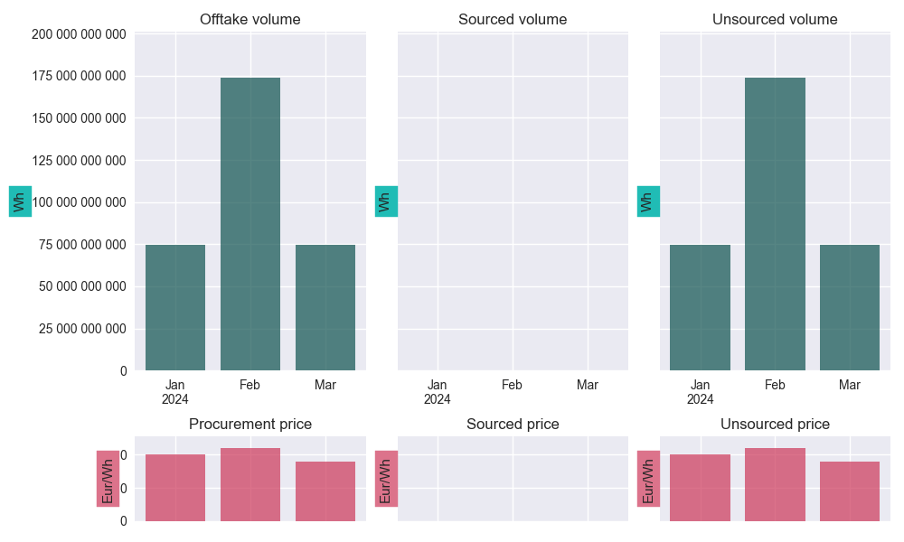
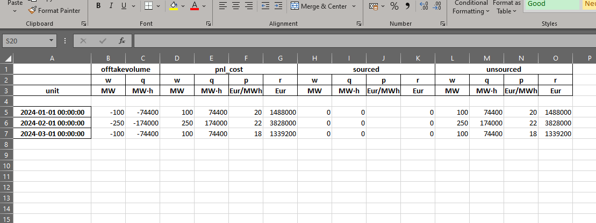

=======
PfState
=======

A "portfolio state" (``PfState``) object stores the timeseries that relate to a portfolio at a certain moment in time. It stores information about the offtake in the portfolio; how much volume has currently been sourced and at what price; how much volume is consequently still unsourced and what is its current market price; what is the current best-guess for the procurement price of the portfolio (i.e., combining sourced and unsourced volumes to satisfy offtake), etc.

This page discusses their most important properties, and how to use them.

It is assumed that you are familiar with the ``PfLine`` class (:doc:`link <pfline>`), and if you prefer a tutorial, :doc:`see here <../tutorial/index>`.

.. contents:: Page contents:
   :depth: 1
   :local:

--------------
Initialisation
--------------

The state of a portfolio has 3 components, which are all specified with portfolio lines:

* the offtake volume (volume-only portfolio line)
* the price of the unsourced volume (price-only portfolio line)
* the sourced volume (price-and-volume portfolio line)

If no volume has been sourced yet, it can be omitted.

With the ``.from_series()`` class method, initialisation is also possible from a set of ``pandas.Series``, which are then internally converted into portfolio lines.

Both initialisation methods are shown here:

.. exec_code::

   import portfolyo as pf, pandas as pd
   index = pd.date_range('2024', freq='MS', periods=3)
   w = pd.Series([-100, -250, -100], index, dtype='pint[MW]')
   p = pd.Series([20, 22, 18], index, dtype='pint[Eur/MWh]')

   # initialise from pflines
   volume = pf.PfLine({'w': w})
   prices = pf.PfLine({'p': p})
   pfs = pf.PfState(volume, prices)

   # initialise from series gives same object
   pfs2 = pf.PfState.from_series(wo = w, pu = p) # same as pfs

   # let's have a look at this portfolio state
   pfs
   # --- hide: start ---
   txt = repr(pfs)
   for source, target in (("●", "o"), ("─", "-"), ("└", "|"), ("├", "|"), ("│", "|")):
      txt = txt.replace(source, target)
   print(txt) 

Note that in this portfolio, no sourcing has yet taken place.

---------------
Unsourced price
---------------

One of the parameters of the initialisation is the ``unsouncedprice``, which needs a little bit of explanation. It is price that we expect to pay (/receive) for the volume that the portfolio is currently short (/long). This is intimately connected to the market prices, but they are not necessarily equal.

If the portfolio state is not aggregated, i.e., has the same frequency as the spot market on which any remaining open volume is eventually settled, the ``unsourcedprice`` can be set to the price-forward curve. It does not depend on the particulars of the portfolio we are considering - completely unhedged or nearly fully hedged; with its offtake predominantly during the day, during the night, during the week or during the weekend.

If the portfolio state *is* aggregated, e.g. to monthly values, we need to supply as ``unsourcedprice`` the average value of the price-forward curve in eath month *weighted with the unsourced volume*. This obviously *does* depend on the particulars of the portfolio. When comparing two portfolios with identical monthly offtake volumes and identical sourced volumes, the monthly unsourced price will be higher for the portfolio that has its offtake predominantly in the peak hours, compared to the other portfolio which has it mainly in the offpeak hours.

For this reason, it is often best/easiest to initialise portfolio states at the shorter time resolution: it allows us to always use the same ``unsourcedprice`` timeseries for each. If another frequency is wanted, we can leave the correct resampling (including the weighting) to the ``.asfreq()`` method, see the :ref:`the section on resampling<Resampling>`.

If the portfolio state includes *past* delivery periods, we must include sensible prices also for their unsourced volumes. Usually, the volumes and their financial impact are small, and we could use the spot prices to value them. In many circumstances, a different price, e.g. imbalance prices, is more applicable. If the portfolio state spans both past and future deliveries, the unsourced price timeseries also consists of a past and future section, likely having a distinct source.

----------------
Sign conventions
----------------

The following conventions are used:

* Volume that leaves the portfolio (e.g. due to offtake) is negative, volume that enters it (e.g. due to sourcing) is positive.

  - Offtake should therefore be negative;
  - Sourcing should be positive in the aggregate, though individual sourcing components can be negative, e.g. when selling long volumes on the spot market.
  - In graphs, offtake and sourcing are often plotted on the same graph, or side-by-side. In that case the offtake is presented with positive values to facilitate the comparison.

* Prices are positive when the buyer of a good pays money to the seller. This is the case in almost all market circumstances.

* The result of the conventions above is that money that enters the portfolio is negative, and money that leaves it is positive. In general: monetary values can be seen as "costs", with negative values being income.

--------------
Accessing data
--------------

Several portfolio lines can be accessed as properties of a ``PfState`` object.

The portfolio lines used/created in the initialisation of the object:

* ``.offtakevolume``: volume-only portfolio line with offtake volume.

* ``.sourced``: price-and-volume portfolio line with volume that has currently been sourced.

* ``.unsourcedprice``: price-only portfolio line with the prices at which to value the volume that must still be procured to fully hedge the offtake profile.

And derived from these:

* ``.unsourced``: price-and-volume portfolio line. The prices are the unsourced prices; the volumes are those that are still unsourced, as calculated from the offtake volume and sourced volume.

.. exec_code::

   # --- hide: start ---
   import portfolyo as pf, pandas as pd
   index = pd.date_range('2024', freq='MS', periods=3)
   vol = pf.PfLine(pd.Series([-100, -250, -100], index, dtype='pint[MW]'))
   pri = pf.PfLine(pd.Series([20, 22, 18], index, dtype='pint[Eur/MWh]'))
   pfs = pf.PfState(vol, pri)
   # --- hide: stop ---
   # continuation from previous code example
   pfs.unsourced
   # --- hide: start ---
   print(repr(pfs.unsourced))

* ``.netposition``: the same as ``unsourced``, but with a reversed sign for the volume and revenue series. It shows the open positions in a way that is familiar for many portfolio managers, with negative volumes indicating short positions that must still be bought.

* ``.sourcedfraction``, ``.unsourcedfraction``: pandas timeseries with the fraction of the offtake that has been (un)sourced. These two timeseries add up to 100% for each timestamp. In the example above, no sourcing has taken place, and so they are a uniform 0 and 1, respectively.

* ``.pnl_cost``: nested price-and-volume portfolio line, with children "sourced" and "unsourced" equal to the portfolio lines described above. This is one of the more important properties, as it shows the best estimate for the procurement price for each timestamp. In this case, this equals the unsourced price, as all offtake is unsourced. 

.. exec_code::

   # --- hide: start ---
   import portfolyo as pf, pandas as pd
   index = pd.date_range('2024', freq='MS', periods=3)
   vol = pf.PfLine(pd.Series([-100, -250, -100], index, dtype='pint[MW]'))
   pri = pf.PfLine(pd.Series([20, 22, 18], index, dtype='pint[Eur/MWh]'))
   pfs = pf.PfState(vol, pri)
   # --- hide: stop ---
   # continuation from previous code example
   pfs.pnl_cost
   # --- hide: start ---
   print(repr(pfs.pnl_cost))

See the :doc:`tutorial <../tutorial/part3>` for a more insightful example.

----------------------------
Plotting / Excel / Clipboard
----------------------------

The ``.plot()``, ``.to_excel()`` and ``.to_clipboard()`` methods exist similarly to on portfolio lines.

Plotting
========

.. exec_code::

   # --- hide: start ---
   import portfolyo as pf, pandas as pd
   index = pd.date_range('2024', freq='MS', periods=3)
   vol = pf.PfLine(pd.Series([-100, -250, -100], index, dtype='pint[MW]'))
   pri = pf.PfLine(pd.Series([20, 22, 18], index, dtype='pint[Eur/MWh]'))
   pfs = pf.PfState(vol, pri)
   # --- hide: stop ---
   # continuation from previous code example
   pfs.plot()
   # --- hide: start ---
   pfs.plot().savefig('docs/savefig/fig_plot_pfs.png')

See the :doc:`tutorial <../tutorial/part3>` for an example with sourcing.

Excel and clipboard
===================

Often, further data analyses are done in Excel. If you have a Workbook open, the easiest way is to copy the entire portfolio state data to the clipboard with the ``.to_clipboard()`` method. From there, it can be pasted onto a worksheet.

Alternatively, the data can be saved as an Excel workbook with the ``.to_excel()`` method.

.. code-block::

   # continuation from previous code example
   pfs.to_clipboard()
   pfs.to_excel("portfolio_state.xlsx")

Of course, if only a part of the portfolio state is needed, we can also access the wanted portfolio *line* and copy/save only that, e.g. with ``pfs.sourced.to_clipboard()``.

.. _resampling:

----------
Resampling
----------

As with portfolio lines, portfolio states can be resampled to a new frequency with the ``.asfreq()`` method. We usually downsample, e.g. from hourly to yearly values. 

.. exec_code::

   # --- hide: start ---
   import portfolyo as pf, pandas as pd
   index = pd.date_range('2024', freq='MS', periods=3)
   vol = pf.PfLine(pd.Series([-100, -250, -100], index, dtype='pint[MW]'))
   pri = pf.PfLine(pd.Series([20, 22, 18], index, dtype='pint[Eur/MWh]'))
   pfs = pf.PfState(vol, pri)
   # --- hide: stop ---
   # continuation from previous code example
   pfs.asfreq('QS')
   # --- hide: start ---
   txt = repr(pfs.asfreq('QS'))
   for source, target in (("●", "o"), ("─", "-"), ("└", "|"), ("├", "|"), ("│", "|")):
      txt = txt.replace(source, target)
   print(txt)

Notice how, for the unsourced volume, the prices are weighted with the energy in each month get the new price, just as is done with the sourced volume. Again, see :doc:`the tutorial <../tutorial/part3>` for a more elaborate example.

----------
Arithmatic
----------

Portfolio states can be added or subtracted, in which case the individual components - offtake volume, sourced and unsourced volumes and prices - are combined according to the rules descibed in the relevant section on arithmatic with :doc:`portfolio lines<./pfline>`.

================================================= ==================
\                                                 Operation possible
================================================= ==================
``-PfState`` (negation)                           ✅                              
``PfState ± PfState``                             ✅                
``PfState * float``                               ✅                              
``PfState / float``                               ✅                   
================================================= ==================

---
API
---

.. autoclass:: portfolyo.PfState
   :members:
   :inherited-members: